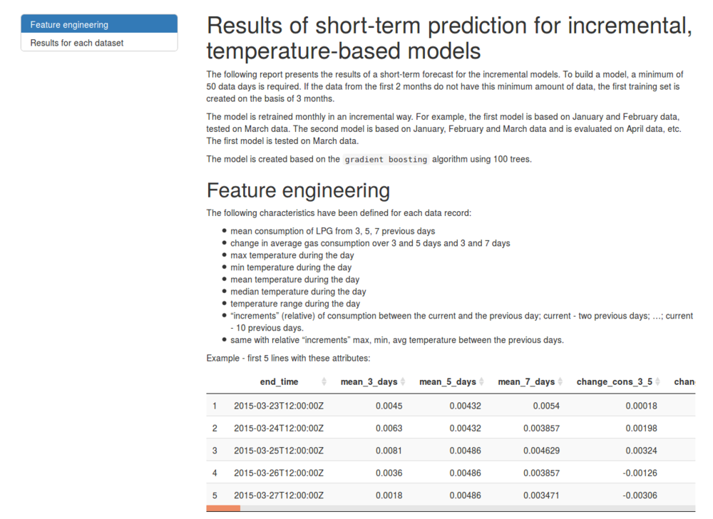
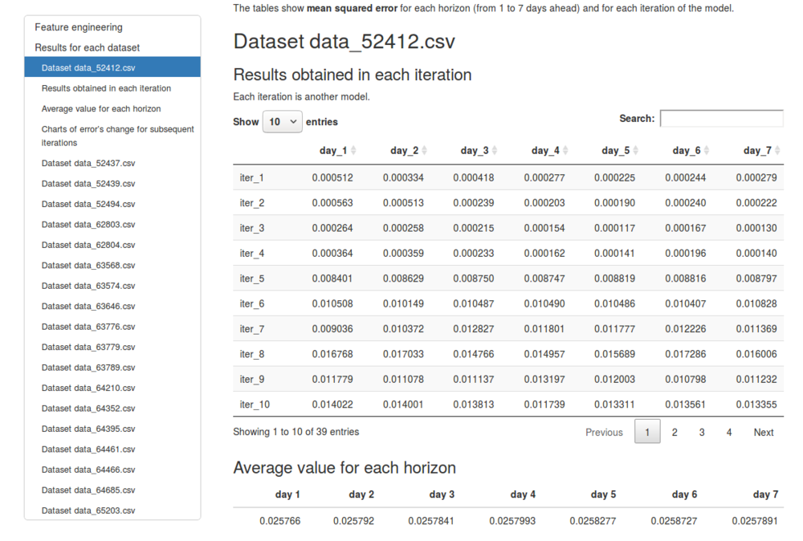
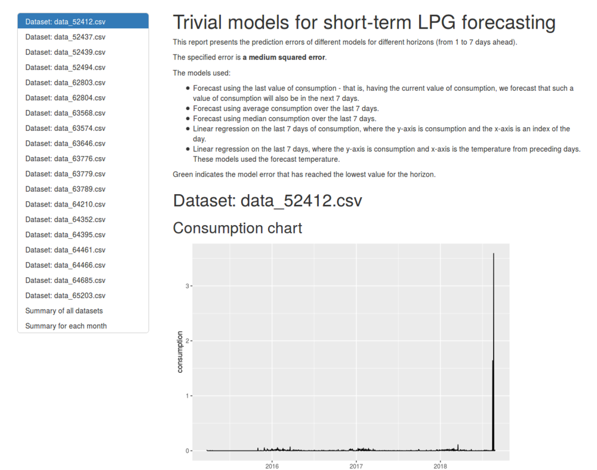
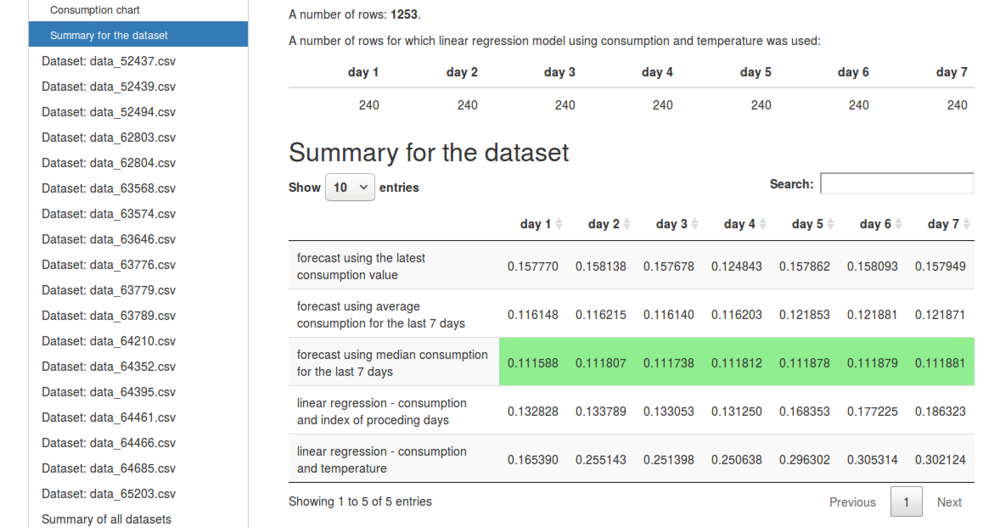

# R Package for performing prediction of LPG usage

This is a repository for R package which helps to perform prediction of LPG consumption.

## Installation

In order to use this package you should have installed:

* [R](https://cran.rstudio.com/)
* [RStudio](https://www.rstudio.com/products/rstudio/download/)

You can install the latest version of this package using `devtools` package:

```r
library(devtools)
devtools::install_github("adaa-polsl/dss4lpg/lpg.short.pred")
library(lpg.short.pred)
```

## Generate reports with the evaluation of predictions

Generating reports with the evaluation of models' predictions can be done by running R functions:

* Trivial models - `lpg.short.pred::generate_naive_models_report()`
* Temperature based model - `lpg.short.pred::generate_gradient_boosting_report()`

Calling these functions with default arguments generates reports using datasets delivered with this package. You can find them in the directory `inst\extdata`.


## Example of reports

<table>
  <tr>
    <td></td>
    <td></td>
  </tr>
  <tr>
    <td></td>
    <td></td>
  </tr>
</table>
